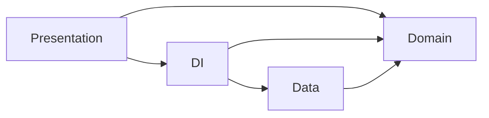

## Code Structure

The repository code dependency structure as shown below :

* Presentation : Android components, UIs/Views, ViewModels and Utils (only Android/UI specific)
* DI (Dependency Injection) : Hilt Module containing objects required for injection in presentation.
* Data : model dtos, repository implementations, remote (as Data source)
* Domain : usecases, repository(interfaces), models, utils (only kotlin/lang specific)

## Api link 
    https://run.mocky.io/v3/4e82ca75-71ea-41d2-91c1-74b8f05a9bf3
